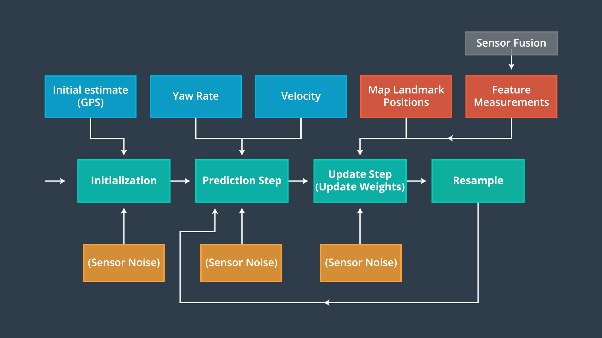
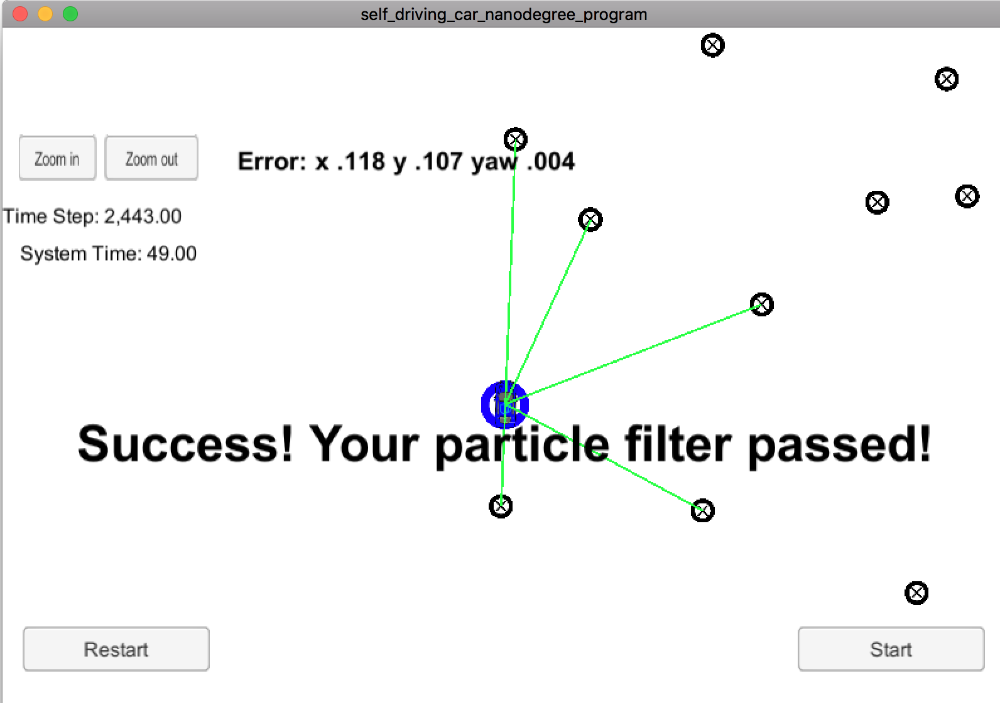

# Kidnapped Vehicle Project

Self-Driving Car Engineer Nanodegree Program

This project implements particle filters for vehicle localization, therefore an autonomous vehicle can identify is whereabouts based on its surrounding. Initial predictions can happen with the help of GPS, however a very precise location can be arrived using particle filters within a range of 2 cm to 10 cm.  

### Concept & Approach

Follows the same steps as per the previous models using kalman filters.

1. Initialize with the very first measurement. In this case, the vehicle will use GPS location for initialization
2. On every incoming measurement from LIDAR/RADAR/Image sensor, update predictions & resample.
3. Compute RMSE, repeat Step 1 with the new error values.

### Results & Discussion

### Environment Setup

Install uWebSocketIO for the respective Operating System by following the documentation [here](https://classroom.udacity.com/nanodegrees/nd013/parts/40f38239-66b6-46ec-ae68-03afd8a601c8/modules/0949fca6-b379-42af-a919-ee50aa304e6a/lessons/f758c44c-5e40-4e01-93b5-1a82aa4e044f/concepts/23d376c7-0195-4276-bdf0-e02f1f3c665d)

### Build and Run 

1. Clone this repo.
2. Run: `./build.sh` this step should compile the source code and create the executable
3. Start Term 2 simulator
4. Run: `./run.sh `